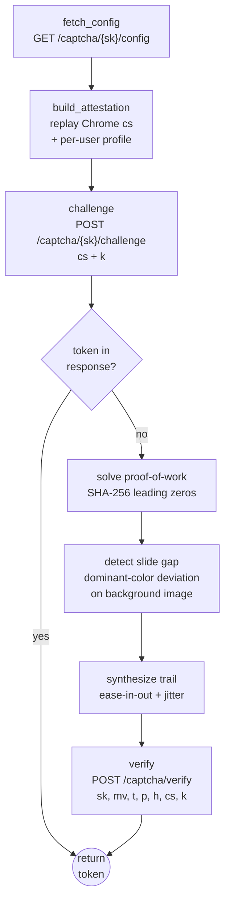

<p align="center">
  
</p>

<h1 align="center">CaptchaFox Solver</h1>

<p align="center">
  A pure-Python <a href="https://captchafox.com">CaptchaFox</a> challenge solver —
  attestation replay, proof-of-work, and slide solving.
  <br/>
  No browser is used in the runtime path.
</p>

<p align="center">
  <a href="LICENSE"></a>
  
  
  
  
</p>

<p align="center"><em>For authorized security testing only.</em></p>

---

## Table of contents

- [Overview](#overview)
- [How it works](#how-it-works)
- [Install](#install)
- [Quickstart](#quickstart)
- [CLI](#cli)
- [Public API](#public-api)
- [Public test keys](#public-test-keys)
- [Responsible use](#responsible-use)
- [License](#license)

## Overview

`captchafox-solver` obtains verified CaptchaFox response tokens by reproducing
each layer of the widget's challenge flow in pure Python: it replays a
real-Chrome browser attestation (`cs`), solves the proof-of-work, and solves
the slide challenge by detecting the puzzle gap in the background image — then
verifies the answer against the CaptchaFox API.



The solver talks to `mam-api.captchafox.com` (the host used by the mail.com
UICDN build) and validates tokens via the public `api.captchafox.com/siteverify`.

## How it works

CaptchaFox binds token issuance to a browser attestation object, a proof-of-work
nonce, and interactive challenge telemetry. This library reimplements each layer:

| Layer | Implementation |
| --- | --- |
| **Attestation (`cs`)** | A real-Chrome `CF0100`–`CF0148` object is captured once (development-time, from a genuine Chromium running `paint.js`); the runtime replays it in pure Python. Per-user fields (screen, GPU, timezone, core count, languages, dark mode) are varied per call via `AttestationProfile`, so each solve presents a distinct, self-consistent fingerprint. The HTTP `User-Agent` is kept constant to match the embedded `CF0115`. |
| **Proof-of-work** | Standard SHA-256. Find the smallest nonce whose `sha256(seed + str(nonce))` hex starts with `N` leading zeros. The seed/difficulty are decoded from the server-issued worker message `[tag, seed, difficulty_binary]`. |
| **Slide challenge** | The puzzle-piece gap left edge is detected in the background image via dominant-color column deviation (Pillow + NumPy), then mapped to CSS pixels. A human-like movement trail (ease-in-out + jitter, max 80 samples) is synthesized. |
| **Transport** | The custom `text/plain` body encoding (JSON → gzip → prefix `[0x01, 0x04]` → per-byte XOR) and the `X-Pulse` header are reproduced. |

## Install

```bash
pip install .
```

Requires Python ≥ 3.10, plus `requests`, `Pillow`, and `numpy`.

## Quickstart

```python
from captchafox_solver import CaptchaFoxSolver

SITE_KEY = "sk_11111111000000001111111100000000"  # public always-succeed test key

solver = CaptchaFoxSolver(site_key=SITE_KEY)
token = solver.solve()
print(token)
```

Each `solve()` mints a fresh randomized attestation profile. To pin a profile:

```python
from captchafox_solver import CaptchaFoxSolver, AttestationProfile

profile = AttestationProfile(
    dark_mode=False, hardware_concurrency=8, timezone_offset=-300,
    languages=("en-US", "en"),
    webgl_vendor="Google Inc. (Google)",
    webgl_renderer="ANGLE (Google, Vulkan 1.3.0 (Intel(R) UHD Graphics 630 (0x00003E9B)), Intel-open-source Mesa)",
    screen_width=1920, screen_height=1080, pixel_ratio=1,
)
solver = CaptchaFoxSolver(site_key=SITE_KEY, profile=profile)
token = solver.solve()
```

### Validate a token with the public siteverify

```python
from captchafox_solver import CaptchaFoxClient

client = CaptchaFoxClient()
result = client.verify_token(
    secret="ok_11111111000000001111111100000000",   # public test secret
    response=token,
    sitekey="sk_11111111000000001111111100000000",
)
assert result["success"] is True
```

### Probe attestation acceptance

Issue a challenge without solving — useful to confirm a given `cs` is accepted
by the live server:

```python
challenge = solver.probe()
print("accepted" if "challenge" in challenge or "token" in challenge else "rejected")
```

## CLI

```bash
# Mint + validate the public test token (validates plumbing end-to-end)
captchafox-solver test

# Solve against a sitekey (random profile per run)
captchafox-solver solve --site-key sk_...

# Probe attestation acceptance only
captchafox-solver solve --site-key sk_... --probe

# Verify an arbitrary token via siteverify
captchafox-solver verify --token TOKEN --secret ok_... --sitekey sk_...
```

## Public API

| Symbol | Purpose |
| --- | --- |
| `CaptchaFoxSolver` | End-to-end solver: `solve(max_attempts=...)` → token (retries on failure), `probe()` → challenge response. |
| `CaptchaFoxClient` | Low-level protocol client: `fetch_config`, `challenge`, `verify`, `verify_token`, `get_test_token`. |
| `build_attestation(site, profile=...)` | Build a `cs` attestation object; varies per-user fields when a profile is given. |
| `AttestationProfile` / `random_attestation_profile()` | Self-consistent per-user fingerprint profile and a random factory. |
| `solve_pow(seed, difficulty)` | Proof-of-work solver. |
| `encode_captchafox_payload(payload)` | The custom binary body encoder. |
| `CaptchaFoxError` | Raised on API failures. |

## Public test keys

CaptchaFox publishes always-succeed test keys for integration testing — use these
to validate plumbing without touching live protection:

```
sitekey: sk_11111111000000001111111100000000
secret:  ok_11111111000000001111111100000000
```

## Responsible use

This project is intended for authorized security testing, red-team
engagements, and CaptchaFox/mail.com resilience research where you have
written authorization from the site operator and the captcha provider.
Standard practice is to test privately and coordinate disclosure with the
vendor before any public discussion of findings. See
[SECURITY.md](SECURITY.md) for the full policy. Do not use this to automate
account creation or abuse services you do not own or are not authorized to test.

## License

MIT — see [LICENSE](LICENSE).
