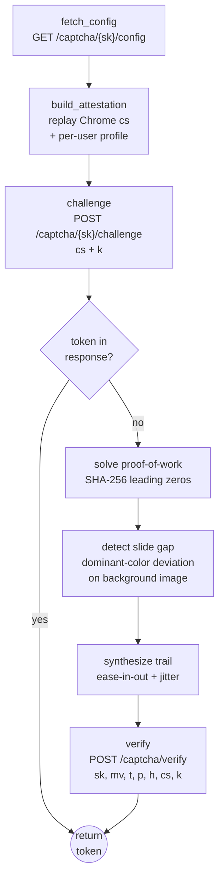

<p align="center">
  
</p>

<h1 align="center">captchafox-solver</h1>

<p align="center">
  A pure-Go <a href="https://captchafox.com">CaptchaFox</a> challenge solver —
  attestation replay, proof-of-work, and slide solving.
  <br/>
  No browser is used in the runtime path.
</p>

<p align="center">
  <a href="LICENSE"></a>
  
  
  
  
</p>

<p align="center"><em>For authorized security testing only.</em></p>

---

## Overview

`captchafox-solver` obtains verified CaptchaFox response tokens by reproducing
each layer of the widget's challenge flow in pure Go: it replays a real-Chrome
browser attestation (`cs`), solves the proof-of-work, and solves the slide
challenge by detecting the puzzle gap in the background image — then verifies
the answer against the CaptchaFox API.



## How it works

| Layer | Implementation |
| --- | --- |
| **Attestation (`cs`)** | A real-Chrome `CF0100`–`CF0148` object is captured once (development-time, from a genuine Chromium running `paint.js`); the runtime replays it in pure Go. Per-user fields (screen, GPU, timezone, core count, languages, dark mode) are varied per call via `AttestationProfile`, so each solve presents a distinct, self-consistent fingerprint. |
| **Proof-of-work** | Standard SHA-256. Find the smallest nonce whose `sha256(seed + nonce)` hex starts with `N` leading zeros. The seed/difficulty are decoded from the server-issued worker message `[tag, seed, difficulty_binary]`. |
| **Slide challenge** | The puzzle-piece gap left edge is detected in the background image via dominant-color column deviation (pure-stdlib `image/png`), then mapped to CSS pixels. A human-like movement trail (ease-in-out + jitter, max 80 samples) is synthesized. |
| **Transport** | The custom `text/plain` body encoding (JSON → gzip → prefix `[0x01, 0x04]` → per-byte XOR) and the `X-Pulse` header are reproduced. |

## Install

```bash
go build -o captchafox-solver .
```

Requires Go ≥ 1.23. No external dependencies (pure stdlib).

## Quickstart

```bash
# Mint + validate the public test token (validates plumbing end-to-end)
captchafox-solver test

# Solve against a sitekey (random profile per run)
captchafox-solver solve --site-key sk_...

# Probe attestation acceptance only
captchafox-solver solve --site-key sk_... --probe

# Verify an arbitrary token via siteverify
captchafox-solver verify --token TOKEN --secret ok_... --sitekey sk_...
```

## Public API (Go)

```go
import "github.com/3z/captchafox-solver/captchafox"

client := captchafox.NewCaptchaFoxClient()
solver := captchafox.NewCaptchaFoxSolver(client, "sk_...", "https://example.com/", "slide", "en", nil)
token, err := solver.Solve(3) // max 3 retry attempts
```

| Symbol | Purpose |
| --- | --- |
| `CaptchaFoxSolver` | End-to-end solver: `Solve(maxAttempts)` → token, `Probe()` → challenge response. |
| `CaptchaFoxClient` | Low-level protocol client: `FetchConfig`, `Challenge`, `Verify`, `VerifyToken`, `GetTestToken`. |
| `BuildAttestation(site, profile)` | Build a `cs` attestation object; varies per-user fields when a profile is given. |
| `AttestationProfile` / `RandomAttestationProfile()` | Self-consistent per-user fingerprint profile and a random factory. |
| `SolvePow(seed, difficulty)` | Proof-of-work solver. |
| `EncodePayload(payload)` | The custom binary body encoder. |

## Packages

| Package | Description |
| --- | --- |
| `captchafox/` | The solver (PoW, encoding, attestation, client, slide gap detection, trail synthesis). |
| `cdp/` | Lightweight CDP (Chrome DevTools Protocol) client for making requests through a real headless Chrome instance (exact Chrome TLS/HTTP-2 fingerprint). Includes a proxy relay for authenticated upstream proxies. |

## Public test keys

CaptchaFox publishes always-succeed test keys for integration testing:

```
sitekey: sk_11111111000000001111111100000000
secret:  ok_11111111000000001111111100000000
```

## Responsible use

This project is intended for authorized security testing, red-team
engagements, and CaptchaFox resilience research where you have written
authorization from the site operator and the captcha provider. See
[SECURITY.md](SECURITY.md) for the full policy.

## License

MIT — see [LICENSE](LICENSE).
